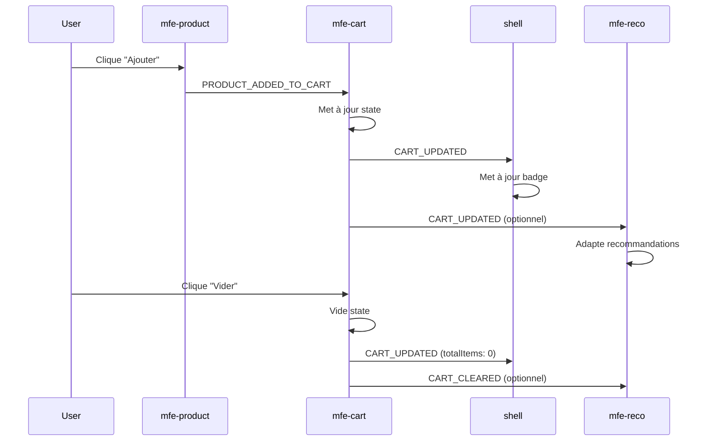

# 📜 Contrat d'Interface — RetroShop MFE

> **Document officiel de négociation Phase 1**  
> Version 1.0 — À respecter strictement pendant la Phase 2

---

## 🎯 Objectif

Ce document définit le **contrat d'événements** entre les 4 Micro-Frontends de RetroShop.  
**Règle d'or :** Aucune déviation tolérée. Nom d'événement ou payload incorrect = silence total.

---

## 🏗️ Architecture des MFE

```
┌─────────────────────────────────────────────────────────┐
│                    SHELL (port 3000)                    │
│  Orchestrateur + Badge panier + Imports lazy           │
└─────────────────────────────────────────────────────────┘
         ↑ CART_UPDATED                    
         │
┌────────┴────────┬─────────────────┬────────────────────┐
│  mfe-product    │   mfe-cart      │    mfe-reco        │
│  (port 3001)    │   (port 3002)   │    (port 3003)     │
│                 │                 │                    │
│  Grille de      │   Panier        │    "Les joueurs    │
│  produits +     │   latéral       │    achètent aussi" │
│  bouton Ajouter │                 │                    │
└─────────────────┴─────────────────┴────────────────────┘
```

---

## 📡 Événements du Système

### 1️⃣ `PRODUCT_ADDED_TO_CART`

**Description :** Déclenché quand un utilisateur clique sur "Ajouter au panier".

| Propriété | Émetteur | Écouteurs |
|-----------|----------|-----------|
| **Qui émet** | `mfe-product` | — |
| **Qui écoute** | — | `mfe-cart`, `mfe-reco` (optionnel) |

#### Payload

```typescript
{
  id: number,           // Identifiant unique du produit
  name: string,         // Nom du produit (ex: "Super Mario Bros")
  price: number,        // Prix unitaire (ex: 49.99)
  image: string,        // Nom du fichier image (ex: "mario.jpg")
  quantity: number      // Toujours 1 lors de l'ajout initial
}
```

#### Exemple de code

```javascript
// Dans mfe-product
const handleAddToCart = (product) => {
  eventBus.emit('PRODUCT_ADDED_TO_CART', {
    id: product.id,
    name: product.name,
    price: product.price,
    image: product.image,
    quantity: 1
  });
};
```

---

### 2️⃣ `CART_UPDATED`

**Description :** Déclenché après chaque modification du panier (ajout, suppression, vidage).

| Propriété | Émetteur | Écouteurs |
|-----------|----------|-----------|
| **Qui émet** | `mfe-cart` | — |
| **Qui écoute** | — | `shell` |

#### Payload

```typescript
{
  totalItems: number,        // Nombre total d'articles (somme des quantités)
  totalPrice: number,        // Prix total du panier
  items: Array<{             // État complet du panier
    id: number,
    name: string,
    price: number,
    image: string,
    quantity: number
  }>
}
```

#### Exemple de code

```javascript
// Dans mfe-cart
const notifyCartUpdate = (cartState) => {
  eventBus.emit('CART_UPDATED', {
    totalItems: cartState.reduce((sum, item) => sum + item.quantity, 0),
    totalPrice: cartState.reduce((sum, item) => sum + (item.price * item.quantity), 0),
    items: cartState
  });
};
```

---

### 3️⃣ `CART_CLEARED` *(Optionnel)*

**Description :** Déclenché quand l'utilisateur vide entièrement le panier.

| Propriété | Émetteur | Écouteurs |
|-----------|----------|-----------|
| **Qui émet** | `mfe-cart` | — |
| **Qui écoute** | — | `mfe-reco` (optionnel) |

#### Payload

```typescript
null  // Aucune donnée nécessaire
```

#### Exemple de code

```javascript
// Dans mfe-cart
const handleClearCart = () => {
  setCart([]);
  eventBus.emit('CART_CLEARED', null);
  eventBus.emit('CART_UPDATED', { totalItems: 0, totalPrice: 0, items: [] });
};
```

---

## 🔄 Diagramme de Flux



---

## 👥 Répartition des Responsabilités

### 🅰️ Étudiant A — `shell`

**Responsabilités :**
- Configurer Module Federation (remotes)
- Importer les 3 MFE en lazy loading
- Écouter `CART_UPDATED` pour mettre à jour le badge panier

**Code attendu :**
```javascript
useEffect(() => {
  const unsubscribe = eventBus.on('CART_UPDATED', (payload) => {
    setBadgeCount(payload.totalItems);
  });
  return unsubscribe;
}, []);
```

---

### 🅱️ Étudiant B — `mfe-product`

**Responsabilités :**
- Configurer Module Federation (exposes)
- Émettre `PRODUCT_ADDED_TO_CART` au clic sur "Ajouter"

**Code attendu :**
```javascript
const handleAddClick = (product) => {
  eventBus.emit('PRODUCT_ADDED_TO_CART', {
    id: product.id,
    name: product.name,
    price: product.price,
    image: product.image,
    quantity: 1
  });
};
```

---

### 🅲 Étudiant C — `mfe-cart`

**Responsabilités :**
- Configurer Module Federation (exposes)
- Écouter `PRODUCT_ADDED_TO_CART`
- Émettre `CART_UPDATED` après chaque modification
- Émettre `CART_CLEARED` lors du vidage (optionnel)

**Code attendu :**
```javascript
useEffect(() => {
  const unsubscribe = eventBus.on('PRODUCT_ADDED_TO_CART', (product) => {
    setCart(prevCart => {
      const newCart = [...prevCart];
      const existing = newCart.find(item => item.id === product.id);
      
      if (existing) {
        existing.quantity += 1;
      } else {
        newCart.push({ ...product });
      }
      
      // Émettre la mise à jour
      eventBus.emit('CART_UPDATED', {
        totalItems: newCart.reduce((sum, item) => sum + item.quantity, 0),
        totalPrice: newCart.reduce((sum, item) => sum + (item.price * item.quantity), 0),
        items: newCart
      });
      
      return newCart;
    });
  });
  
  return unsubscribe;
}, []);
```

---

### 🅳 Étudiant D — `mfe-reco` *(Si équipe de 4)*

**Responsabilités :**
- Configurer Module Federation (exposes)
- Écouter `CART_UPDATED` et/ou `CART_CLEARED`
- Adapter les recommandations selon le panier

**Code attendu :**
```javascript
useEffect(() => {
  const unsubscribe = eventBus.on('CART_UPDATED', (payload) => {
    const cartProductIds = payload.items.map(item => item.id);
    // Filtrer les recommandations pour exclure les produits déjà dans le panier
    setRecommendations(allProducts.filter(p => !cartProductIds.includes(p.id)));
  });
  
  return unsubscribe;
}, []);
```

---

## ⚠️ Points Critiques

### ❌ Erreurs Mortelles

1. **Faute de frappe dans le nom d'événement**
   ```javascript
   // ❌ MAUVAIS
   eventBus.emit('CART_UDPATED', data);  // Typo
   
   // ✅ BON
   eventBus.emit('CART_UPDATED', data);
   ```

2. **Payload incomplet ou incorrect**
   ```javascript
   // ❌ MAUVAIS
   eventBus.emit('PRODUCT_ADDED_TO_CART', { id: 1, name: "Mario" });
   
   // ✅ BON
   eventBus.emit('PRODUCT_ADDED_TO_CART', {
     id: 1,
     name: "Mario",
     price: 49.99,
     image: "mario.jpg",
     quantity: 1
   });
   ```

3. **Oubli du cleanup**
   ```javascript
   // ❌ MAUVAIS
   useEffect(() => {
     eventBus.on('CART_UPDATED', handler);
   }, []);
   
   // ✅ BON
   useEffect(() => {
     const unsubscribe = eventBus.on('CART_UPDATED', handler);
     return unsubscribe;  // ← Crucial pour éviter les memory leaks
   }, []);
   ```

### ✅ Checklist de Validation

Avant de commencer la Phase 2, chaque membre doit :

- [ ] Avoir noté les noms exacts des événements (copier-coller)
- [ ] Connaître la structure exacte de chaque payload
- [ ] Savoir quel(s) événement(s) il doit émettre
- [ ] Savoir quel(s) événement(s) il doit écouter
- [ ] Avoir compris que `eventBus.on()` retourne une fonction de cleanup

---

## 🧪 Tests Manuels Recommandés

Pour vérifier votre implémentation en Phase 2 :

```javascript
// Dans votre composant
console.log('🔴 [mfe-product] Émission PRODUCT_ADDED_TO_CART:', payload);
console.log('🟢 [mfe-cart] Réception PRODUCT_ADDED_TO_CART:', payload);
console.log('🔵 [shell] Réception CART_UPDATED:', payload);
```

Si les logs ne s'affichent pas dans l'ordre attendu → erreur de contrat.

---

## 📚 Ressources

- **EventBus source :** `shared/eventBus.js`
- **Products data :** `shared/products.js`
- **Webpack Module Federation :** https://webpack.js.org/plugins/module-federation-plugin/

---

## 📝 Signatures

Chaque membre signe ce document pour valider sa compréhension :

| Étudiant | Rôle | Émet | Écoute | Signature |
|----------|------|------|--------|-----------|
| A | shell | — | `CART_UPDATED` | __________ |
| B | mfe-product | `PRODUCT_ADDED_TO_CART` | — | __________ |
| C | mfe-cart | `CART_UPDATED`, `CART_CLEARED` | `PRODUCT_ADDED_TO_CART` | __________ |
| D | mfe-reco | — | `CART_UPDATED`, `CART_CLEARED` | __________ |

---

**Date de négociation :** _______________  
**Validé par l'équipe :** ☐ OUI  ☐ NON

---

> 💡 **Rappel :** Ce contrat est la clé de réussite du projet. Tout écart = échec silencieux.  
> Bonne chance pour la Phase 2 ! 🚀